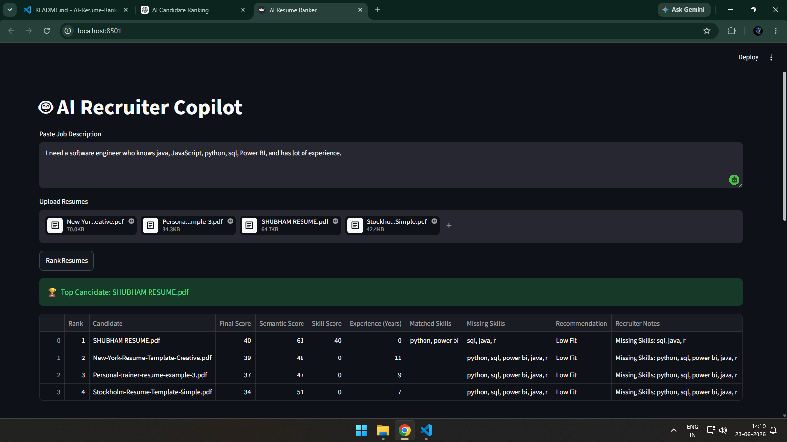

# 🤖 AI Recruiter Copilot
### Intelligent Candidate Ranking & Resume Screening System

AI Recruiter Copilot is an AI-powered candidate ranking platform that helps recruiters identify the best candidates for a job role by combining semantic understanding, skill matching, and experience evaluation.

Unlike traditional ATS systems that rely heavily on keyword matching, this solution understands the meaning of resumes and job descriptions using NLP and transformer-based embeddings.

---

# 📌 Problem Statement

Recruiters often receive hundreds of applications for a single role.

Most Applicant Tracking Systems (ATS):

- Depend heavily on keyword matching
- Miss qualified candidates with different wording
- Cannot understand semantic meaning
- Ignore experience relevance
- Produce unreliable candidate rankings

This leads to:

- Poor hiring decisions
- Increased screening time
- Loss of qualified talent

AI Recruiter Copilot solves this problem by intelligently ranking candidates based on skills, experience, and semantic relevance.

---

# 🎯 Objective

Build an AI system that:

- Understands job requirements
- Analyzes candidate resumes
- Extracts technical skills
- Estimates professional experience
- Measures semantic similarity
- Ranks candidates intelligently
- Provides recruiter-friendly recommendations

---

# 🚀 Key Features

## Resume Processing

✅ Upload multiple resumes

✅ Supports PDF files

✅ Supports DOCX files

✅ Automatic text extraction

---

## Job Description Analysis

✅ Paste any Job Description

✅ Automatic skill extraction

✅ JD requirement understanding

---

## Candidate Evaluation

✅ Skill Match Analysis

✅ Missing Skill Detection

✅ Experience Estimation

✅ Semantic Similarity Calculation

---

## AI Ranking Engine

✅ Hybrid Candidate Scoring

✅ Intelligent Candidate Ranking

✅ Recruiter Recommendations

✅ Explainable Results

---

## Reporting

✅ Ranked Candidate Table

✅ Download Results as CSV

✅ Interactive Dashboard

---

# 🏗️ System Architecture

## Input Layer

### Recruiter Inputs

- Job Description
- Candidate Resumes

---

## Processing Layer

### Resume Parser

Responsible for:

- Reading PDF resumes
- Reading DOCX resumes
- Extracting clean text

Module:

```python
resume_parser.py
```

### Skill Extraction Engine

Responsible for:

- Extracting technical skills
- Matching JD skills
- Detecting missing skills

Module:

```python
skill_extractor.py
```

### Experience Analysis Engine

Responsible for:

- Detecting years of experience
- Estimating candidate seniority

Module:

```python
experience_extractor.py
```

---

## AI Layer

### Semantic Matching

Uses transformer embeddings to understand contextual meaning rather than exact keyword matches.

Model:

```text
BAAI/bge-small-en-v1.5
```

### Similarity Measurement

Uses cosine similarity to compare:

```text
Resume ↔ Job Description
```

---

## Ranking Layer

Calculates:

- Skill Match Score
- Semantic Similarity Score
- Experience Score

Combines them into a final ranking score.

Module:

```python
ranker.py
```

---

## Output Layer

Produces:

- Ranked Candidates
- Candidate Score
- Recommendation Label
- Missing Skills
- Experience Estimate

---

# 🧠 Methodology

## Step 1

Recruiter enters Job Description.

---

## Step 2

System extracts required skills.

Example:

```text
Python
SQL
Machine Learning
Power BI
```

---

## Step 3

Candidate resumes are uploaded.

---

## Step 4

Text is extracted from each resume.

---

## Step 5

Skills are identified from each resume.

---

## Step 6

Semantic similarity is calculated using embeddings.

---

## Step 7

Experience is estimated.

---

## Step 8

Hybrid scoring engine generates final rankings.

---

# 📊 Scoring Methodology

The final score combines three major factors.

## Formula

```text
Final Score =
(Semantic Score × 40%)
+
(Skill Score × 40%)
+
(Experience Score × 20%)
```

---

## Semantic Score

Measures how closely the resume matches the job description contextually.

Range:

```text
0 – 100
```

---

## Skill Score

Measures:

```text
Matched Skills / Required Skills
```

Example:

```text
Required Skills = 10

Matched Skills = 8

Skill Score = 80%
```

---

## Experience Score

Estimated from resume content.

Example:

```text
0-1 Years → Beginner

2-4 Years → Intermediate

5+ Years → Experienced
```

---

# 🤖 Recruiter Recommendation Engine

Candidates are automatically classified.

| Score | Recommendation |
|---------|---------------|
| 85+ | Strong Fit |
| 70-84 | Good Fit |
| Below 70 | Low Fit |

---

# 📂 Project Structure

```text
AI-Resume-Ranker/
│
├── app.py
├── resume_parser.py
├── skill_extractor.py
├── experience_extractor.py
├── ranker.py
├── requirements.txt
├── README.md
images/*****
.gitignore
```

---

# 🛠️ Technology Stack

## Frontend

- Streamlit

## Backend

- Python

## AI / NLP

- Sentence Transformers
- BGE Embeddings
- Scikit-learn

## Data Processing

- Pandas
- NumPy

## Document Processing

- PyPDF2
- python-docx

---

# ⚙️ Installation

## Clone Repository

```bash
git clone https://github.com/Shubhamkeshri433/AI-Resume-Ranker.git
```


```bash
cd AI-Resume-Ranker
```

---

## Create Virtual Environment

```bash
python -m venv venv
```

---

## Activate Environment

Windows:

```bash
venv\Scripts\activate
```

---

## Install Dependencies

```bash
pip install -r requirements.txt
```

---

## Run Application

```bash
streamlit run app.py
```

---

# 📸 Application Screenshots

## Home Page


---

## Upload Resumes


---

## Ranking Results




---

## Skill Analysis


---

# 📈 Sample Output

| Rank | Candidate | Score | Recommendation |
|--------|------------|--------|---------------|
| 1 | Candidate A | 92 | Strong Fit |
| 2 | Candidate B | 84 | Good Fit |
| 3 | Candidate C | 72 | Good Fit |
| 4 | Candidate D | 58 | Low Fit |

---

# 🎯 Business Impact

The system helps recruiters:

- Reduce manual screening effort
- Improve hiring accuracy
- Discover hidden talent
- Shortlist candidates faster
- Improve recruitment efficiency

---

# 🔮 Future Enhancements

- LLM-based candidate summaries
- ATS integration
- Interview recommendation system
- Recruiter dashboard
- Cloud deployment
- Vector database integration
- Multi-language resume analysis

---

# 👨‍💻 Author

**Shubham Keshri**

GitHub:

https://github.com/Shubhamkeshri433

---

# 📄 License

This project is developed for educational, research, and hackathon purposes.